## 1. Open [Google Cloud Platform](https://cloud.google.com) and click on `CONSOLE`
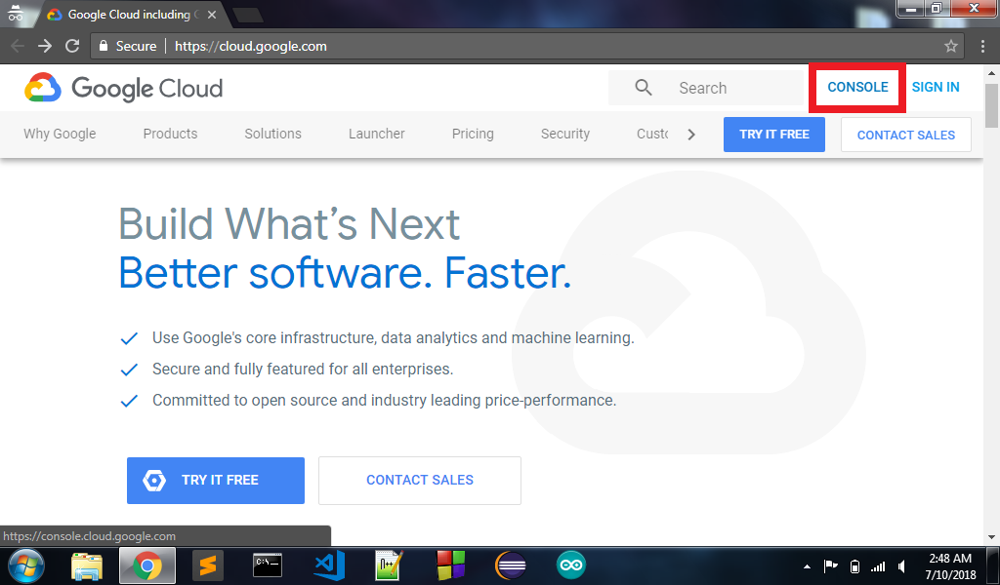
## 2. Signin with your account
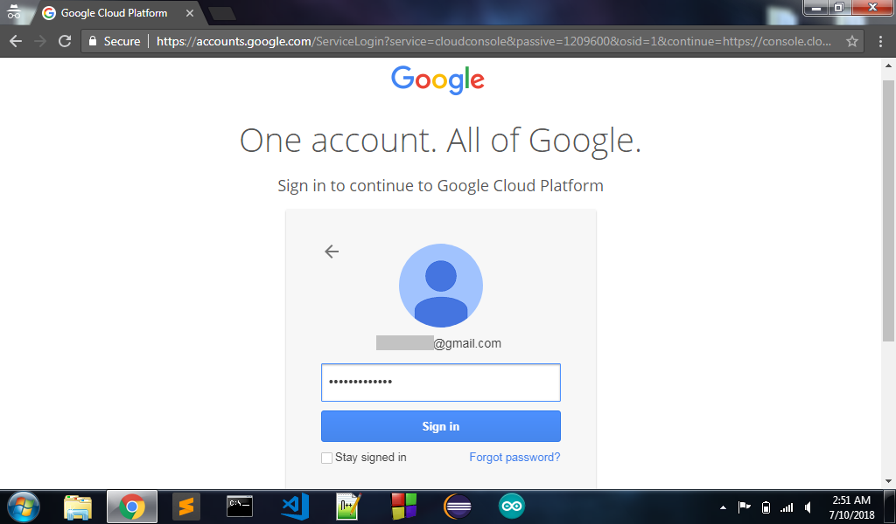
## 3. Check yes to conditions and click `AGREE AND CONTINUE`
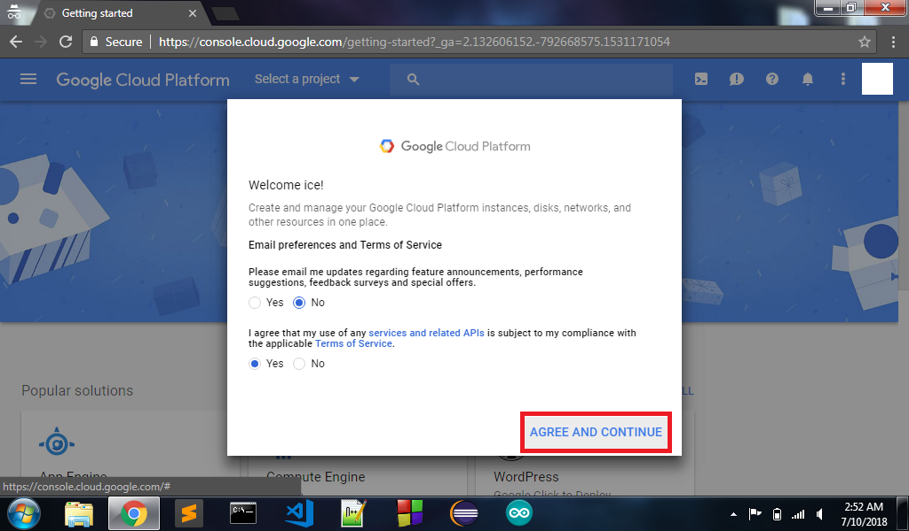
## 4. Click on `Select a project`
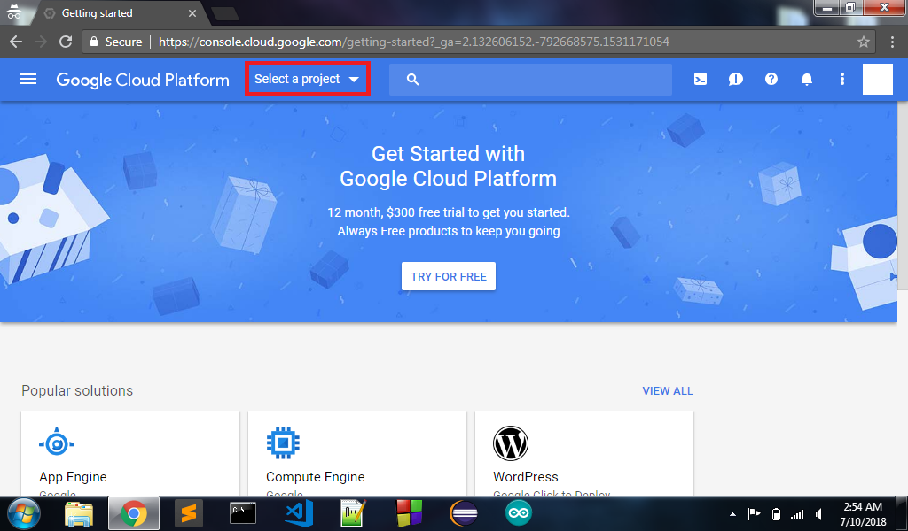
## 5. Click on `NEW PROJECT`
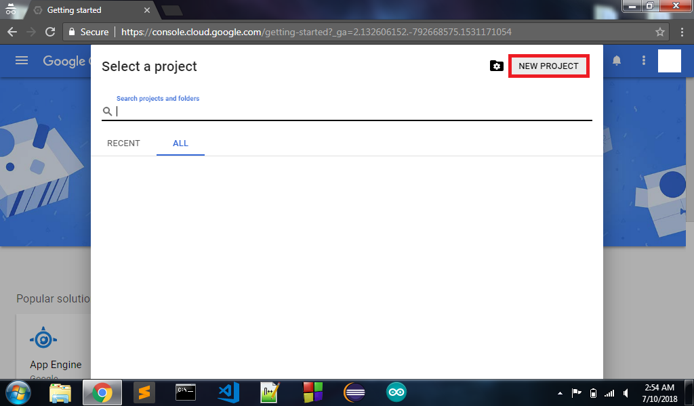
## 6. Provide `Project Name` and click on `CREATE`
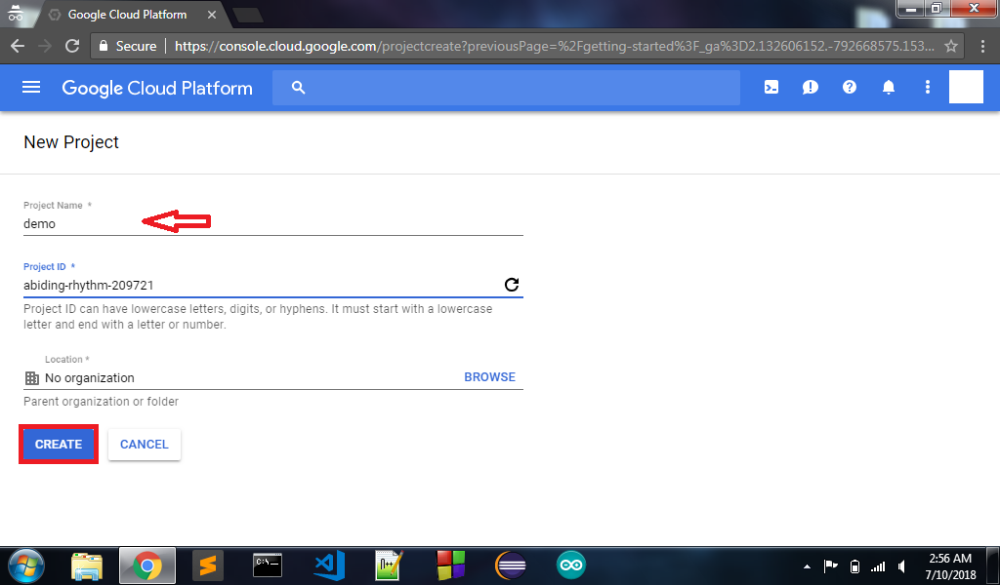
## 7. Check in notifications and click on `Create Project`
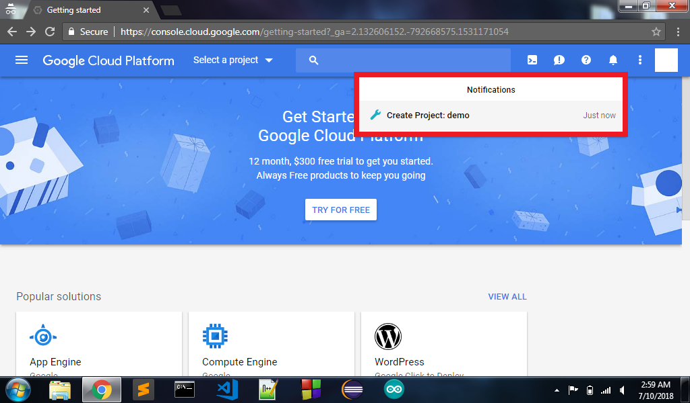
## 8. In APP DASHBOARD click on `Go to APIs overview` or `Enable APIs and get credentials like keys`
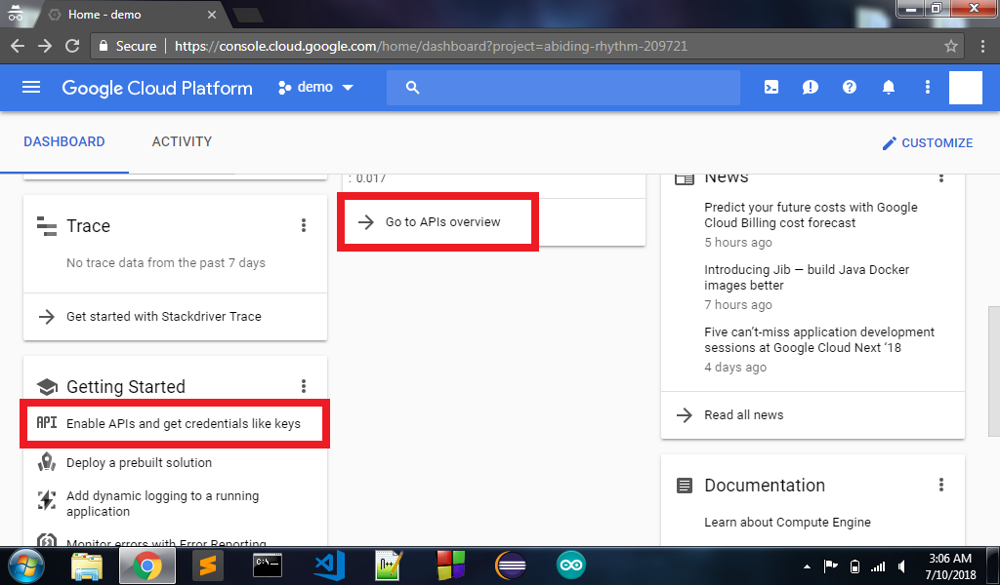
## 9. In API DASHBOARD click on `ENABLE APIS AND SERVICES`
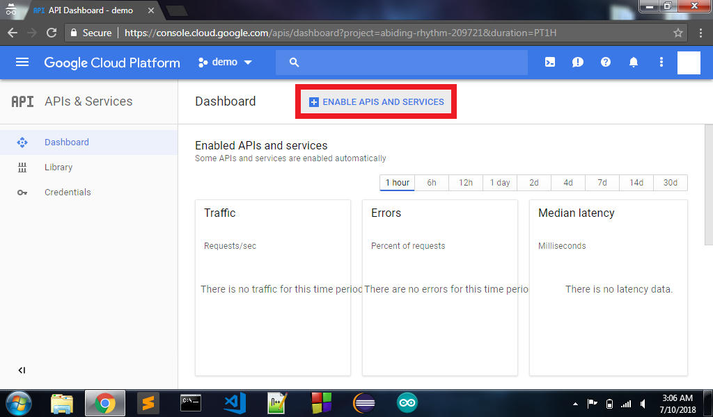
## 10. In API Library search for `Google Drive` and click on it
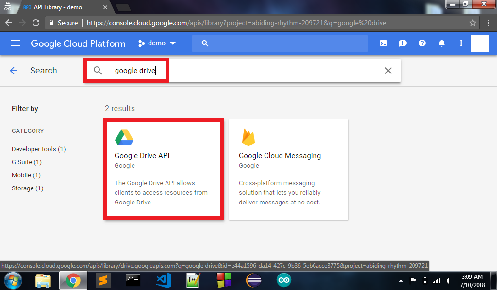
## 11. Click on `Enable`
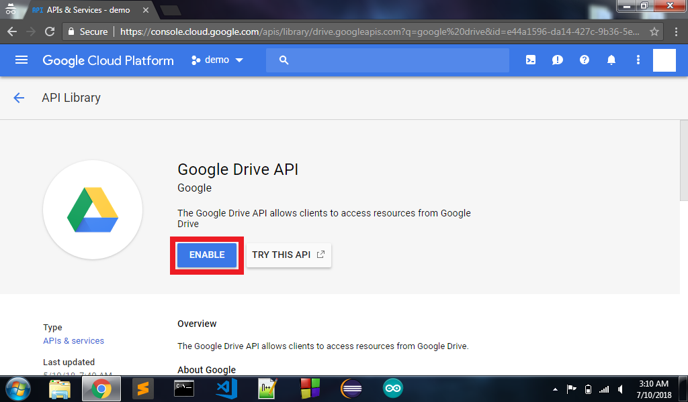
## 12. Click on `Create Credentials`
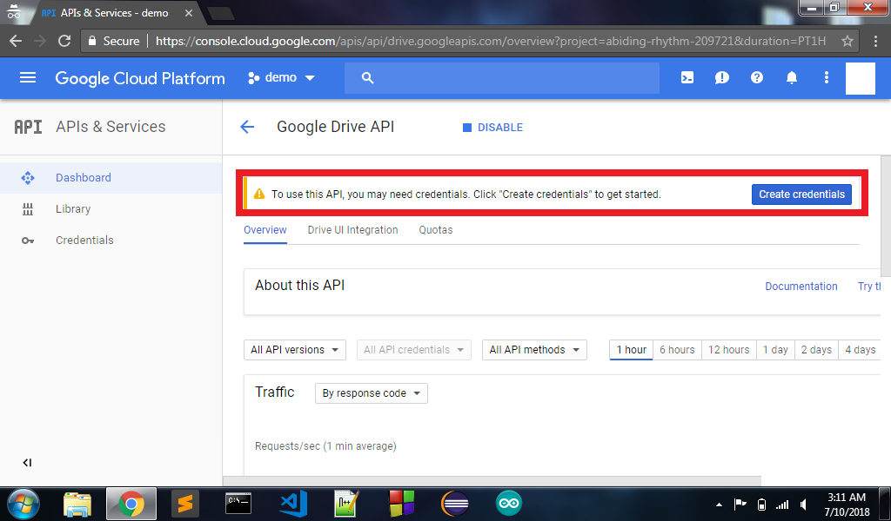
## 13. Click on `service account`

## 14. Provide `Service account name`, `Service account ID`, set `Role as Project Owner`, check `Key type as JSON` and click on `Continue`
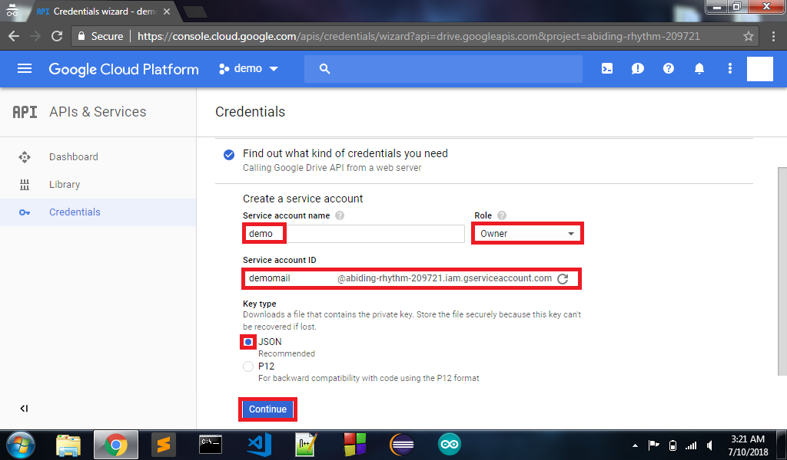
## 15. JSON file will download
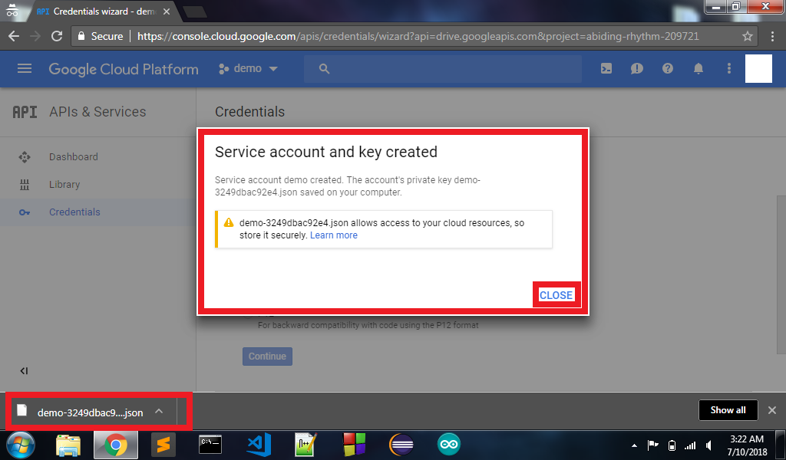
## 16. Open JSON file in text editor and find `client_email` and `private_key`. These two will be needed in requiring Muggler in your node app 
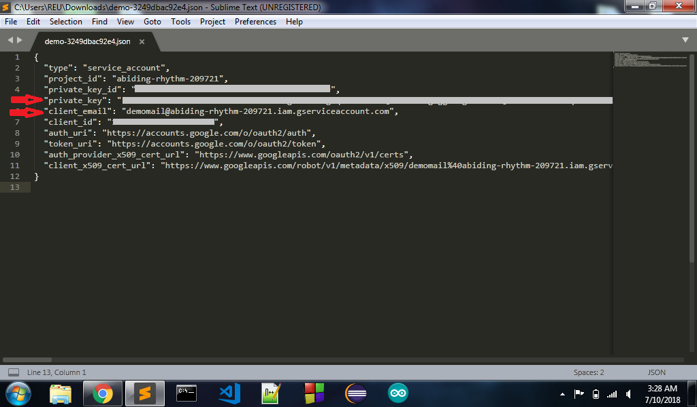
